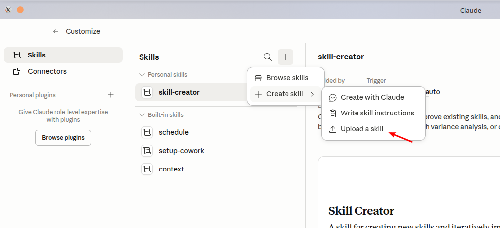
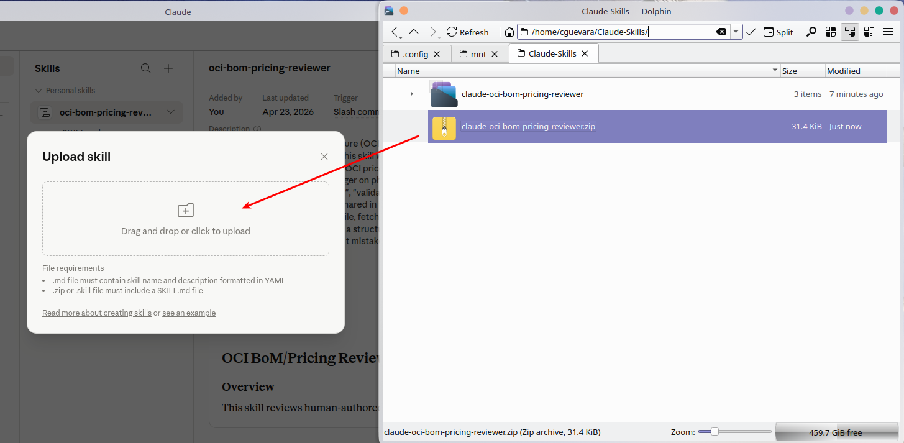
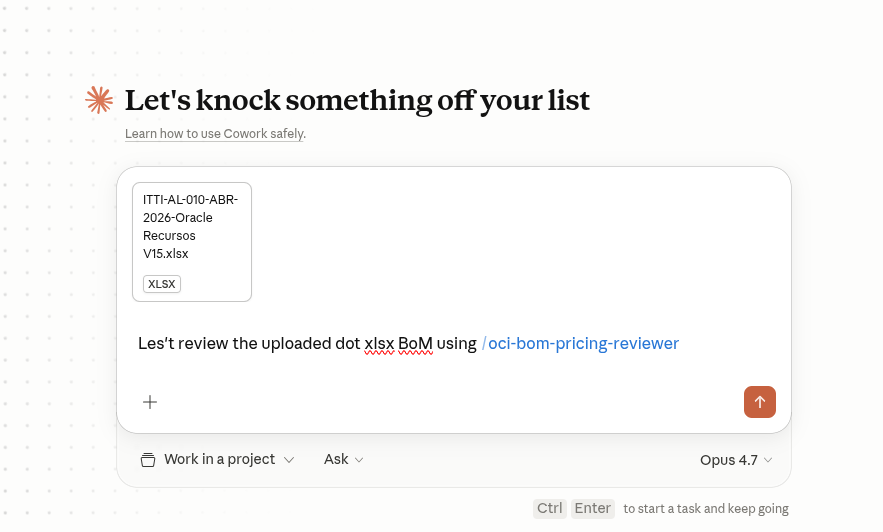
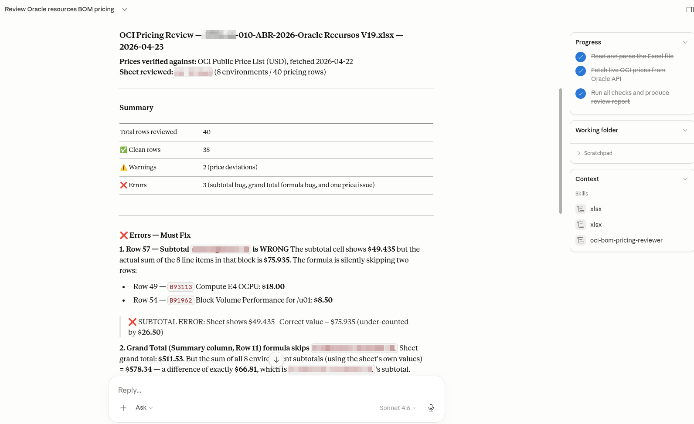

# OCI BoM / Pricing Reviewer

A Claude skill that reviews Oracle Cloud Infrastructure (OCI) pricing
spreadsheets — Bills of Materials, cost estimates, and customer workload
sizings built in Excel — against **live OCI list prices** fetched from
Oracle's public price API. Built for the pre‑sales engineers and solution
architects who author these sheets and need an automated sanity check before
they reach a customer.

---

## What the skill checks

| # | Check | Severity |
|---|-------|----------|
| A | SKU / Part number exists in the current OCI catalog | ❌ Error |
| B | Unit price matches current OCI list price (flags ALL deltas) | ⚠️ Warning |
| C | Unit of measure matches the API `metricName` | ⚠️ Warning |
| D | OCPU SKUs have their paired Memory SKU (E3/E4/E5, X9, A1/A2, …) | ❌ Error |
| E | OCPU : Memory ratio is between 1:4 and 1:16 GB per OCPU | ⚠️ Warning |
| F | Row math — `qty × unit_price = line_total` | ❌ Error |
| G | Subtotals and grand totals add up | ❌ Error |
| H | Monthly hours per row ∈ {720, 730, 744} and consistent within a sheet | ❌ Error |
| I | Single currency per sheet; workbook sheets use the same currency | ❌ / ⚠️ |

Full check descriptions live in [SKILL.md](SKILL.md).

## What the skill produces

Every run delivers **two** artifacts so the engineer can pick their workflow:

1. A concise review report printed in the chat (Errors, Warnings, Clean rows,
   and a Notes section).
2. An **annotated copy of the workbook** written to
   `/mnt/user-data/outputs/<original-filename>-reviewed.xlsx`:
   - Red fill on cells with errors, yellow fill on cells with warnings
   - A cell comment on each flagged cell describing the finding
   - A `__Review Summary__` sheet at the front mirroring the chat report

> **Live prices only.** The skill performs a preflight check against
> `https://apexapps.oracle.com/pls/apex/cetools/api/v1/products/`. If the API
> is unreachable it refuses to run — there is no offline price fallback.

---

## Installation

### 1. Clone the repository

```bash
git clone https://github.com/cguevarav/claude-oci-bom-pricing-reviewer.git
```

This creates a folder `claude-oci-bom-pricing-reviewer/` containing
`SKILL.md`, the `references/` folder, and the installation screenshots.

### 2. Package the folder as a zip

Claude's skill uploader accepts a single `.zip` (or `.skill`) file that
contains `SKILL.md` plus any reference files. Create it from the parent
directory of the clone:

```bash
cd ..                            # step out of the cloned folder
zip -r claude-oci-bom-pricing-reviewer.zip claude-oci-bom-pricing-reviewer \
    -x "claude-oci-bom-pricing-reviewer/.git/*" \
       "claude-oci-bom-pricing-reviewer/.github/*"
```

The `-x` flags exclude the `.git` directory (and any CI metadata) from the
archive so you ship only what the skill runtime needs. The resulting zip is
roughly 30 KB.

### 3. Open Claude → Skills → Upload a skill

In Claude, open **Settings → Customize → Skills**. Click the **+** button
next to the Skills header, hover **Create skill**, and choose
**Upload a skill**.



### 4. Drop the zip into the Upload dialog

Drag `claude-oci-bom-pricing-reviewer.zip` from your file manager onto the
drop zone labelled *"Drag and drop or click to upload"*.



Claude parses the embedded `SKILL.md`, validates the YAML frontmatter, and
registers the skill. It then appears under **Personal skills** as
`oci-bom-pricing-reviewer`.

### 5. Invoke the skill in a chat

Start (or open) a chat, attach the OCI pricing spreadsheet you want reviewed,
and invoke the skill with `/oci-bom-pricing-reviewer`:



Claude will then:

1. Preflight the OCI API — aborts cleanly if the API is unreachable
2. Parse every sheet in the workbook (English / Spanish / mixed headers)
3. Fetch live prices only for the SKUs present in the workbook (in parallel)
4. Run Checks A through I
5. Print the review report in chat **and** write the annotated workbook to
   `/mnt/user-data/outputs/`

The skill also triggers implicitly on phrases like *"review my OCI pricing"*,
*"check this OCI estimate"*, or simply attaching an `.xlsx` in an OCI context.

### 6. Review the results

Within a few seconds Claude returns the structured report in the chat: a
summary row, then each ❌ Error and ⚠️ Warning with the offending row, SKU,
and exact numbers (sheet value vs. OCI list value). In the example below, a
40-row workbook came back with 38 clean rows, 2 price warnings, and 3
blocking errors — including a grand-total formula that was silently skipping
two rows.



Alongside the chat report, the annotated workbook is written to
`/mnt/user-data/outputs/<filename>-reviewed.xlsx`. Download it from the chat,
open it in Excel / LibreOffice / Numbers, and each flagged cell will be
colored (red = error, yellow = warning) with a cell comment describing the
finding. The `__Review Summary__` sheet at the front mirrors the chat report,
so the workbook travels on its own without needing to forward the transcript.

Pick whichever surface fits your workflow:

- **In-chat report** — fastest for triage; copy-paste fixes straight back to the author.
- **Annotated workbook** — best when you want to fix the sheet in place and re-run, or hand it to someone else to correct.

---

## Requirements

- A Claude subscription with Skills enabled (desktop, web, or IDE extension)
- Outbound HTTPS access from the Claude sandbox to
  `apexapps.oracle.com` (Oracle's public, unauthenticated price API)
- Input file must be an `.xlsx` workbook (openpyxl-parseable)

## Repository layout

| Path | Purpose |
|------|---------|
| [SKILL.md](SKILL.md) | The skill definition — this is what Claude reads |
| [references/oci-sku-pairing-rules.md](references/oci-sku-pairing-rules.md) | Which SKUs must appear together (OCPU ↔ Memory, etc.) |
| [images/](images/) | The installation screenshots used in this README |
| [LICENSE](LICENSE) | MIT license |

## Updating the skill

When `SKILL.md` changes, re-zip and upload again from the same dialog —
Claude will replace the existing skill entry with the new version.

## License

MIT — see [LICENSE](LICENSE).
